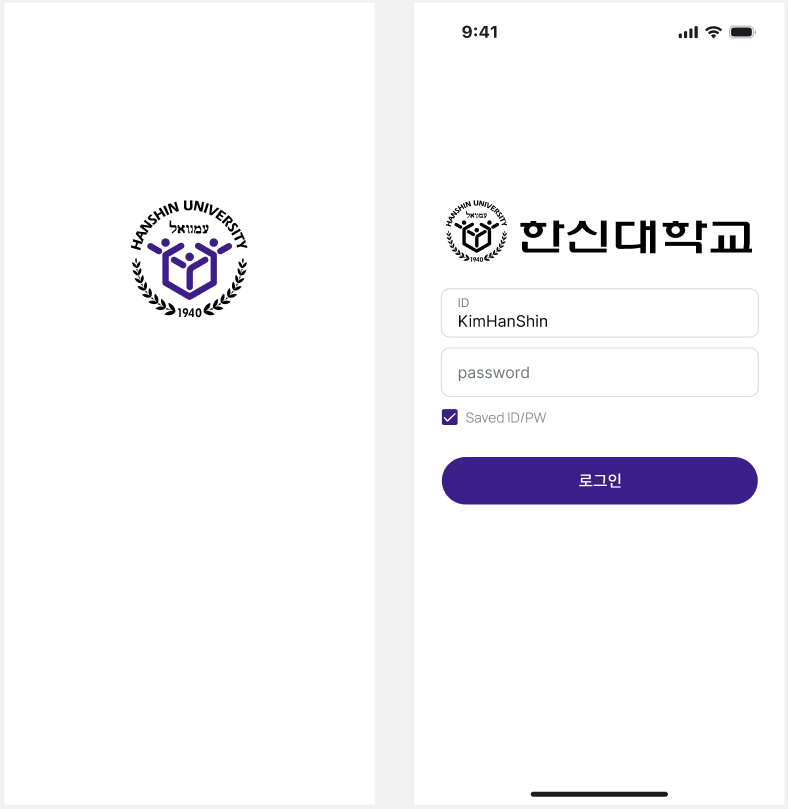
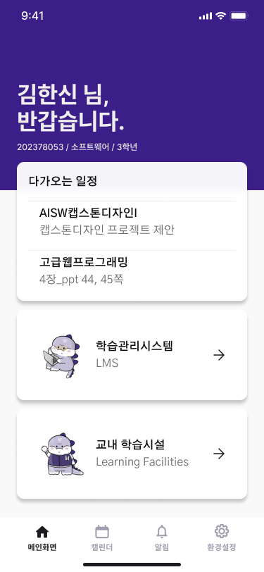

**아래는 깃허브 리드미 작성 가이드 (작성 후 삭제 예정)**
```
1. README 표지
2. 하이퍼링크 (선택)
3. 프로젝트 간단 소개
4. 핵심 기능
5. 팀명/팀구성
6. 역할 설명
7. 개발환경 (프론트/백엔드/협업 툴(디스코드, 카카오톡, 깃허브, 피그마), 디자인(피그마) 등)
8. 벤치마킹/사용한 개발 기술
9. UI/UX 디자인
10. 모바일 프로그래밍 (Android Studio)
11. 개발 기간
12. 프로젝트 후기

*DB다이어그램 넣기
*실행방법 넣기
```

<br>

<!-- <h1 align="center">
  <br>
  9조 이러다졸업조 UpCrew
  <br>
  한신대학교 학생학습지원앱
  <br>
</h1>
<p align="center">
  <a href="#key-features">수정 필요</a> •
  <a href="#프로젝트-개요">프로젝트 개요</a> •
  <a href="#팀 구성">팀 구성</a> •
  <a href="#key-features">Key Features</a> •
  <a href="#실행-방법">실행 방법</a> •
-->

<br>

# 📖 한신대학교 학생학습지원앱 README


<br>

## 1. 프로젝트 개요
한신대학교 학생학습지원앱은 하나의 통합 플랫폼에서 학습시설 혼잡도 확인, 예약 및 Learning Management System(LMS) 기능을 제공하는 모바일 애플리케이션이다.

<br>
  
## 1-1. 핵심 기능
### [학습시설] 혼잡도 확인
  - OpenCV를 활용해 학습 시설 내 인원 현황을 파악
  - 혼잡도 상태를 "여유 / 보통 / 혼잡" 3단계로 표시
  - 실시간으로 각 공간(카페, 라운지 등)의 이용현황 확인 가능
    
### [학습시설] 좌석 예약 시스템
  - 도서관, 스터디룸 등 예약이 필요한 공간에 대해 좌석 선택 및 예약 가능
  - 예약 시 해당 좌석은 자동으로 '사용 중' 상태로 전환
    
### [LMS] 일정 관리 및 푸시 알림
  - 한신대학교 LMS와 연동하여 접근성 강화
  - 개인 일정 관리
     - 일정 확인을 위한 캘린더 기능 제공
     - 다가오는 일정: 최근접 2개 일정 홈화면 표기
  - 푸시 알림
     - 공지/과제/온라인 강의: 등록 시 푸시 알림
     - 과제/온라인 강의: 기한 마감 3일, 1일 전 푸시 알림
    
### [보안] 사용자 인증 및 권한 관리
  - 한신대학교 통합로그인 정보에 기반한 회원 가입 및 로그인 기능 제공
  - 학생/교수 구분에 따른 접근 권한 설정
    
<br>

## 1-2. 채택 개발 기술 및 벤치마킹
- tmp

<br>

## 2. 팀명 및 팀 구성
### 팀명
* 9조 - 이러다졸업조 (UPCrew)

### 팀 구성
* 전채영 (팀장. AISW계열 소프트웨어)
* 이나경 (팀원. AISW계열 소프트웨어/인공지능)
* 이민정 (팀원. AISW계열 데이터사이언스/소프트웨어)

<br>

## 2-1. 역할 분담
### 전채영
* **(주) DB**
  - 한 내용 적기
* 모바일 프로그래밍(Android Studio)
  - tmp
  
<br>

### 이나경
* **(주) AI**
  - 한 내용 적기
* 모바일 프로그래밍(Android Studio)
  - tmp

<br>

### 이민정
* **(주) UI/UX**
  - 한 내용 적기
 
<br>

## 3. 개발 환경
* **Front-end**: 
* **Back-end**: 
* **UI/UX Design**: Figma
* **Collaboration Tools**: Discord, KakaoTalk, GitHub, Figma
 
<br>

## 시스템 서버 및 아키텍처

To clone and run this application, you'll need [Git](https://git-scm.com) and [Node.js](https://nodejs.org/en/download/) (which comes with [npm](http://npmjs.com)) installed on your computer. From your command line:

```bash
# Clone this repository
$ git clone https://github.com/amitmerchant1990/electron-markdownify

# Go into the repository
$ cd electron-markdownify

# Install dependencies
$ npm install

# Run the app
$ npm start
```

> **Note**
> If you're using Linux Bash for Windows, [see this guide](https://www.howtogeek.com/261575/how-to-run-graphical-linux-desktop-applications-from-windows-10s-bash-shell/) or use `node` from the command prompt.

<br>

## UI/UX 
FIGMA 작업 페이지: [캡스톤디자인_이러다졸업(UPCrew)_FIGMA](https://www.figma.com/design/Z9tQCgVkBRwPdPOc9ZHZh1/%EC%BA%A1%EB%94%94_%EC%9D%B4%EB%9F%AC%EB%8B%A4%EC%A1%B8%EC%97%85?node-id=0-1&t=YM0C7m7QOdhPkOWA-1)

### [시작/로그인 화면]
* **시작 화면**
  - 애플리케이션 실행 시 표기되는 화면
* **로그인 화면**
  - 시작 화면 직후 표기되는 화면
  - 한신대학교 통합로그인 정보로만 로그인 가능
  - 저장된 로그인 계정이 있는 경우 생략
    
| 시작 화면(좌) / 로그인 화면(우) |
|----------|
|  |

### [메인 화면]
* **메인 화면**
  - 로그인 후 진입하는 첫 번째 화면
  - 하단의 '메인화면' 버튼으로 바로가기 기능 지원
* **상세**
  - [상단] 학적 확인
  - [다가오는 일정] 기한이 가장 임박한 2개 일정 미리보기
  - [학습관리시스템] LMS 페이지로 이동
  - [교내 학습시설] 학습시설 현황 및 예약 페이지로 이동
    
| 메인 화면 |
|----------|
|  |

<br>

## Credits

This software uses the following open source packages:

- [Electron](http://electron.atom.io/)
- [Node.js](https://nodejs.org/)
- [Marked - a markdown parser](https://github.com/chjj/marked)
- [showdown](http://showdownjs.github.io/showdown/)
- [CodeMirror](http://codemirror.net/)
- Emojis are taken from [here](https://github.com/arvida/emoji-cheat-sheet.com)
- [highlight.js](https://highlightjs.org/)

<br>

## Related

[Try Web version of Markdownify](https://notepad.js.org/markdown-editor/)
